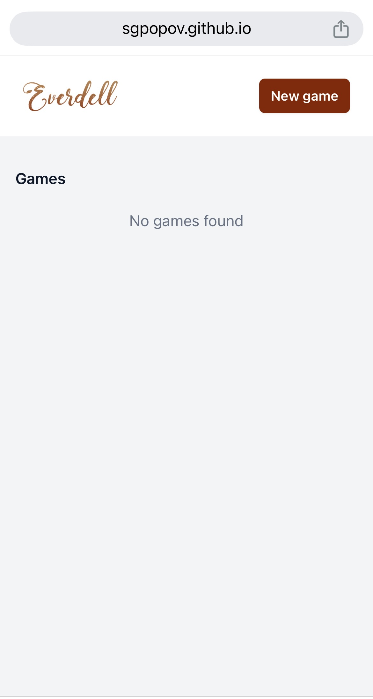
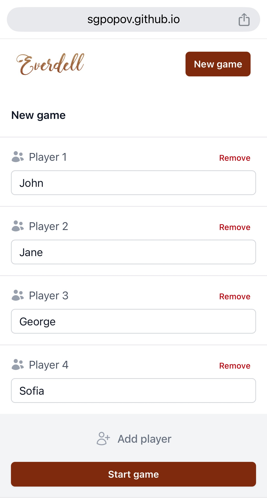
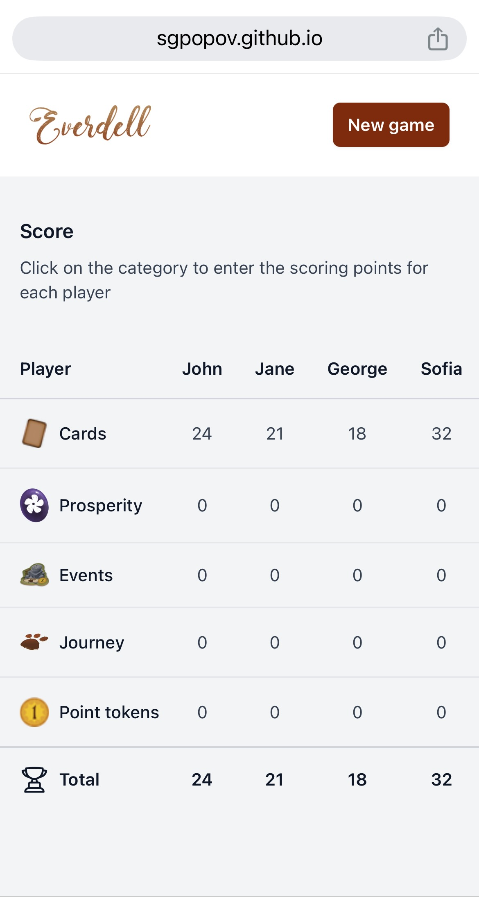
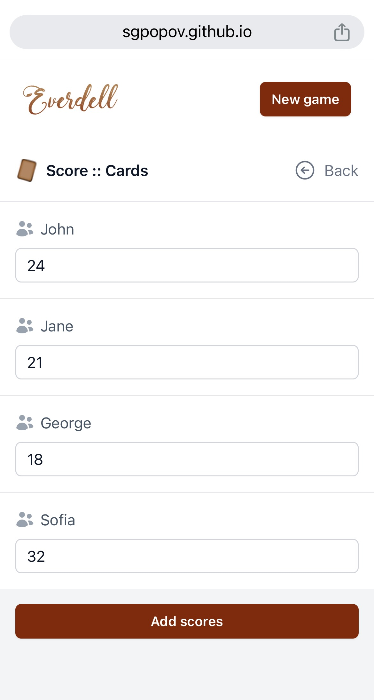

# Everdell Scoring App

Everdell Scoring App is a simply companion app for tracking your scores in the enchanting world of Everdell. Say goodbye to manual calculations and let the app handle scoring for you, ensuring a smooth and accurate endgame tally. With an intuitive interface, you can easily input points from constructions, critters, events, and prosperity cards, all while enjoying a beautifully themed design that complements the game's charming woodland aesthetic.

View game details on BoardGameGeek - https://boardgamegeek.com/boardgame/199792/everdell

## Features

- User-friendly interface for managing player scores.
- Responsive design using Tailwind CSS.
- State management with Pinia for a seamless experience.
- Easy setup and configuration.

<div style="display: flex; justify-content: space-between;">
    
    
    
    
</div>

## Installation

1. Clone the repository:
   ```
   git clone <repository-url>
   cd everdell-scoring-app
   ```

2. Install dependencies:
   ```
   npm install
   ```

3. Run the application:
   ```
   npm run serve
   ```

## Contributing

Contributions are welcome! Please open an issue or submit a pull request for any enhancements or bug fixes.

## License

This project is licensed under the MIT License. See the LICENSE file for details.